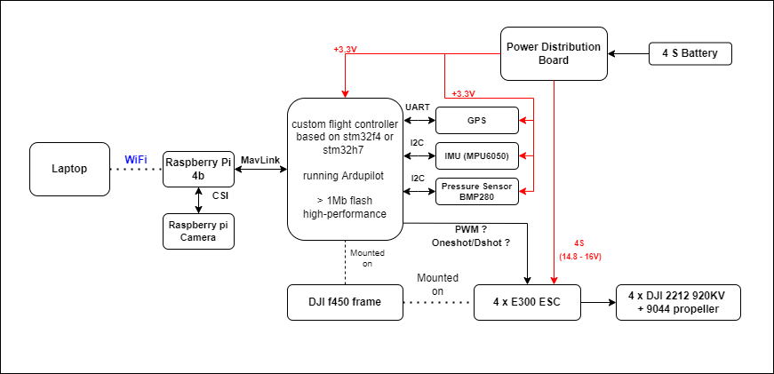
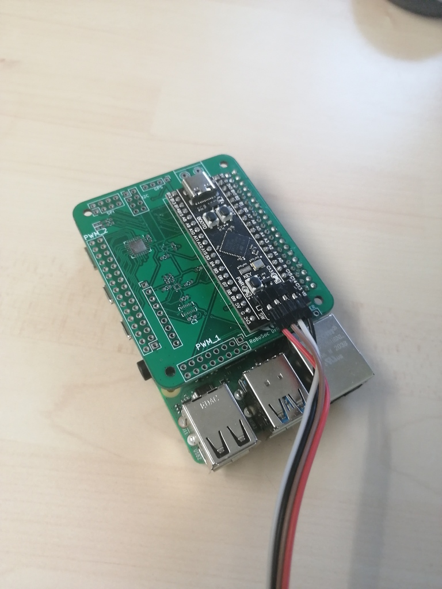
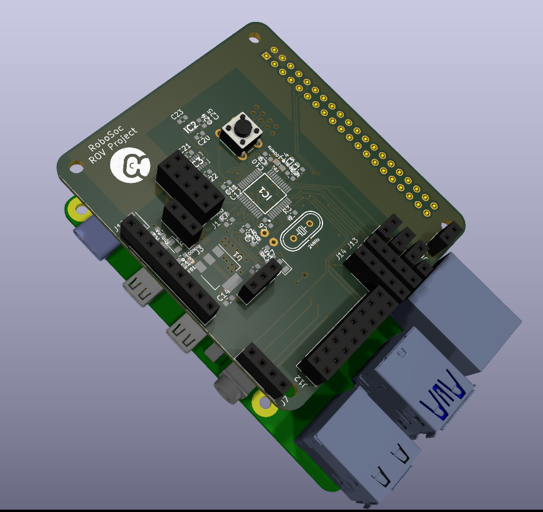
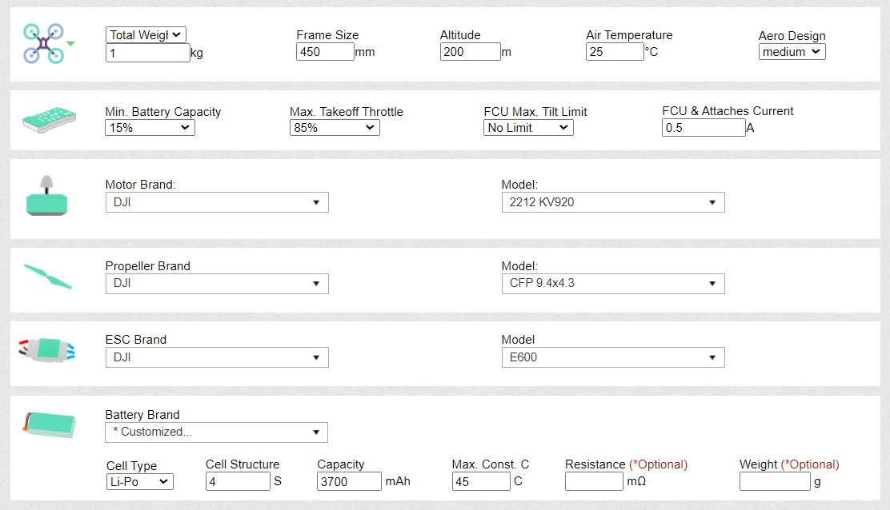
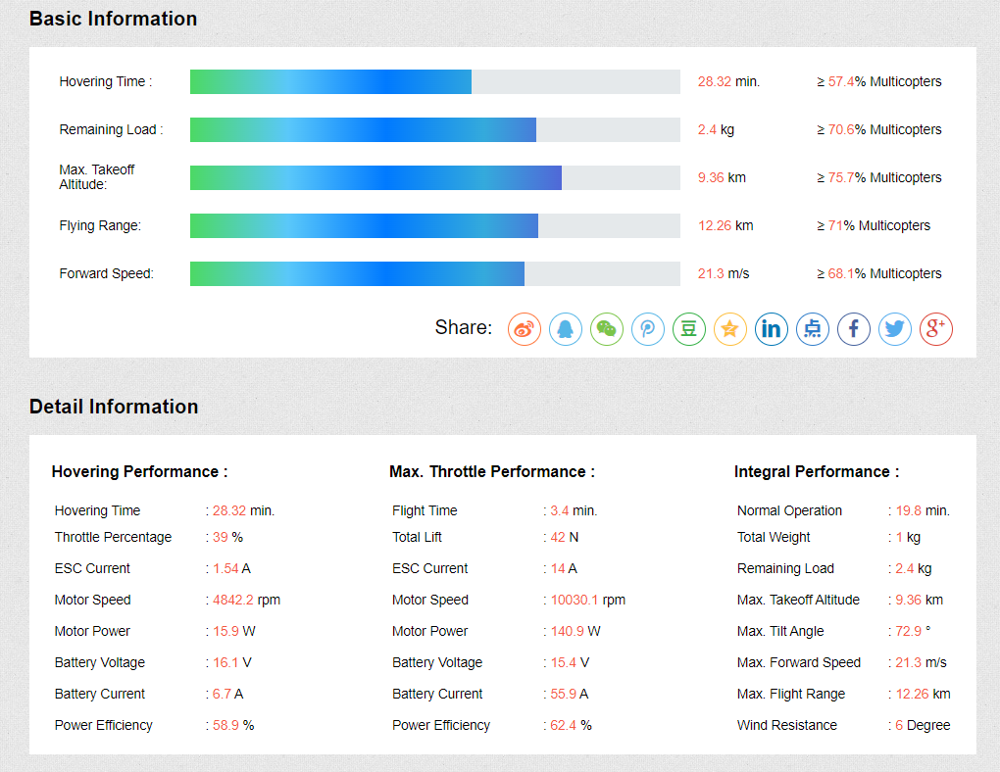
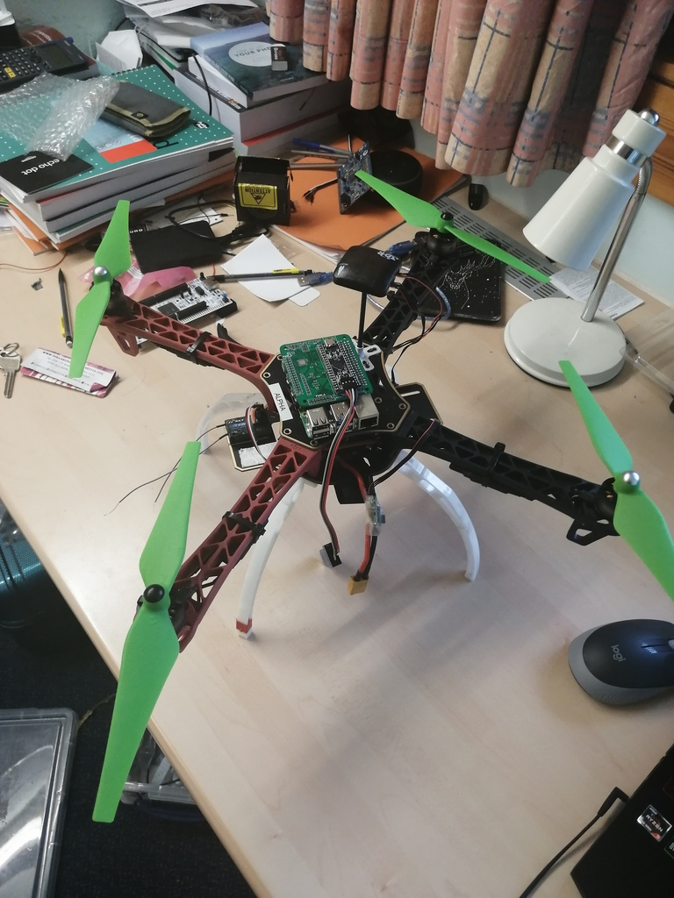

# Quala

### Description
The goal of the project is to create an open drone that could be used potentially in future for running future project. Some initial idea was to create a drone swarm ( smaller drones "scouters" and larger drones "tankers", [Alex's pitch text needed for that]). Overall we want to have: 
- an OK performance mechanics ( we got the good donations and have stuff from DJI ), 
- own flight controller ( or at least ported by us to ardupilot in order to understand it better and modify our system in future)
- Video processing, communication and streaming done on raspberry pi ( open source, easy to modify, used in university courses)
- Control ( or sending command) done by Laptop

### System Diagram :

## Components :
- Frame : [DJI F450](https://www.unmannedtechshop.co.uk/product/f450-quadcopter-frame-with-integrated-pdb/) 
- Autopilot : [Ardupilot](https://ardupilot.org/)
- ESCs : [E300](https://www.dji.com/uk/e300) (used now) or [XXD 30A](https://uk.banggood.com/Wholesale-XXD-HW30A-30A-Brushless-Motor-ESC-For-Airplane-Quadcopter-p-50621.html?utm_source=googleshopping&utm_medium=cpc_organic&gmcCountry=GB&utm_content=minha&utm_campaign=minha-gbg-en-pc&currency=GBP&cur_warehouse=CN&createTmp=1&utm_source=googleshopping&utm_medium=cpc_us&utm_content=jeff&utm_campaign=jeff-co-pla-all-11sale-uk-211021&ad_id=554630521428&gclid=CjwKCAjwrqqSBhBbEiwAlQeqGvUba-68dGHQIvDt9tkU8KaKOyWThmB51lSY50i6YMVbNij9YVvPQBoCxCkQAvD_BwE) ( just because of cheap, maybe utilized in future)
- Motors : DJI 2212 motor 920kv ( standard DJI motors that came with the motors)
- Controller : Designed by us Board with stm32f411 or stm32h745/755 
- Video Processing / Communication (WiFi) : [Raspberry pi 4b](https://www.raspberrypi.com/products/raspberry-pi-4-model-b/) or [Pi Zero W 2](https://www.raspberrypi.com/products/raspberry-pi-zero-2-w/)
- Battery : [Tattu 4S 3700mAh](https://www.unmannedtechshop.co.uk/product/tattu-3700mah-45c-4s1p-lipo/)
- GPS : ( link needed ) 
- IMU : [MPU6050](https://invensense.tdk.com/products/motion-tracking/6-axis/mpu-6050/) ( support for drivers from Ardupilot), or [ISM330](https://estore.st.com/en/ism330dhcxtr-cpn.html) (high performance, not supprted by Ardupilot, plan to add it to our design )
- Pressure Sensor : [BMP280](https://www.bosch-sensortec.com/products/environmental-sensors/pressure-sensors/bmp280/) (stanadard pressure sensor)
- Power Distribution Board : Used by the one on DJI or this [one](https://www.unmannedtechshop.co.uk/product/power-distribution-board-with-led-voltage-regulator/)

### Autopilot + controller
Goal is to familliarize ourselves with [Ardupilot](https://ardupilot.org/) autopilot ( very good, active, great community and open project) so that we can contribute further to it. We wanted to designed custom controller for it. Due to lack of components we settled for black-pill board ( with stm32f411. There is a problem with flash size that is 512kB, ardupilot requires much more). 

We designed also controller on which we can place directly the microcontroller ( to avoid flash size issues, we can place stm32f405 or stm32h755)

Communication between flight controller and raspberry pi is as described [here](https://ardupilot.org/dev/docs/raspberry-pi-via-mavlink.html).

### Video streaming
normally it requires video data streaming protocol (.h264 or .h265). Unfortunately we weren't able to achieve good results on it ( very high latency) so we settled for motion-jpeg streaming with low resolutions. 

### Theoretical evaluation 
Theoretical evaluation of the design was done on [flyeval.com](flyeval.com) ( [Introduction to Multicopter Design and Control, Quan Quan 2017](https://link.springer.com/book/10.1007/978-981-10-3382-7) ) and the screenshots below are taken from that website. 

#### Performance of Model

#### Mathematical model of design

### pics from picture
(components, not yet working)

### Ardupilot notes: 
Sparky2, speedybeef4, SuccexF4, VRBrain-v51,
[17:33]
Compatible IMUs :
[17:35]
BMI055, BMI088, BMI160, BMI270, MPU6000, MPU9250,  ICM20608, ICM20602, ICM20601, ICM20789, ICM20689,  ICM20948, ICM20648 and ICM20649, ICM-40609, ICM-42688, ICM-42605, ICM-40605, IIM-42652, L3G4200D, LSM9DS0, LSM9DS1,
[17:39]
Compatible PRessure : BMP085, BMP280, BMP388, DPS280, FBM320, ICM20789, LPS2XH, MS5611,  SPL06
[17:42]
GPS : NMEA, NOVA, SBF, SBP, SBP2, SIRF, UAVCAN, UBLOX, RTCM3
